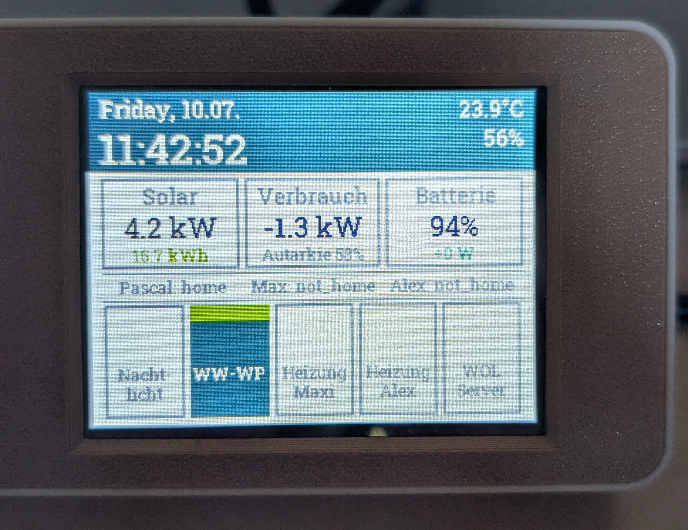

# CYD Home-Energie-Monitor mit Steuerung
Layout zum Energiemonitoring und Steuerung ESPHome und HomeAssistant

Nachdem ich mir einige Cheap Yellow Displays mit resistivem Touchscreen und ESP32-Controller gekauft habe, habe ich mir einen kleinen Energiemonitor designt und möchte euch das Layout bzw die YAML zur Verfügung stellen.

Die folgende YAML soll die Steuerung meiner beiden Wallboxen ermöglichen in dem ESP-Home (unter Home Assistant) die Befehle empfängt und umsetzt.

Voraussetzungen:
- Home Assistant
- ESP-Home als Plugin
- Wetter-Plugin bzw. Entität

Folgende Möglichkeiten sind realisiert:

- Anzeige Uhrzeit und Datum
- Anzeige Temperatur und Luftfeuchte
- Anzeige PV-Erzeugung aktuell und als Summe über den Tag
- Anzeuge aktueller Energiefluss des Hauses und Autarkiegrad
- Anzeige Ladestand des Akkus und Energiefluss
- Anzeige Anwesenheit einzelner Personen (über Device-Tracking)
- 5 Schaltflächen, um einzelne Entitäten anzusteuern (äußerst rechte sendet einen Wake-on-lan-Ping an meinen Server.

Ich habe versucht die Dokumentation möglichst ausführlich zu gestalten, so dass eine Anpassung auf eure Edentitäten und Konfiguration einfach sein sollte

Ich hoffe das Design gefällt euch!

Viel Spaß damit :-)
